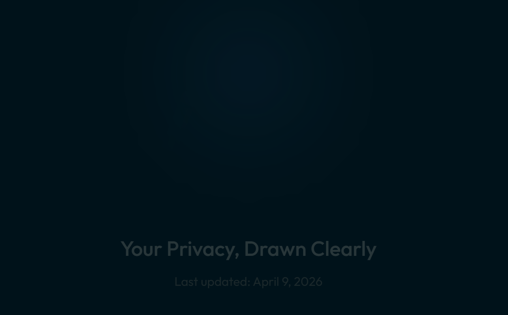

# Scribble Privacy Policy Site

<div align="center">
  

  ### 🖋️ Scribble - Creativity Unleashed
  [**Download on Google Play**](https://play.google.com/store/apps/details?id=com.twentyminCode.scribble)
</div>

---

## 📄 Overview

This repository contains the official privacy policy website for **Scribble**, a mobile application dedicated to creative expression and boredom-busting. 

The site is designed to be as transparent and lightweight as the app itself, providing a clear and accessible guide to how we handle user data (or rather, how we *don't*).

## 🛡️ Privacy Principles

The policy site covers several key pillars of our commitment to user privacy:

- **Privacy First**: We believe privacy is a right, not a feature.
- **No Data Collection**: We don't track your identity or your scribbles.
- **Local Processing**: Creative logic happens on your device whenever possible.
- **Transparent Monetization**: Clear information about ads and payments.

## 🚀 Tech Stack

- **Framework**: [React 19](https://react.dev/) + [Vite](https://vitejs.dev/)
- **Styling**: [Tailwind CSS 4](https://tailwindcss.com/)
- **Animations**: [Motion](https://motion.dev/)
- **Content**: [React Markdown](https://github.com/remarkjs/react-markdown) for dynamic policy rendering.
- **Deployment**: [GitHub Pages](https://pages.github.com/) via GitHub Actions.

## 🛠️ Local Development

To run this site locally for testing or updates:

1.  **Clone the repo**:
    ```bash
    git clone https://github.com/Saderius/scribble-privacy-policy.git
    cd scribble-privacy-policy
    ```
2.  **Install dependencies**:
    ```bash
    npm install
    ```
3.  **Run development server**:
    ```bash
    npm run dev
    ```
4.  **Build for production**:
    ```bash
    npm run build
    ```

## 🏗️ Deployment

This project uses a GitHub Actions workflow to automatically deploy the site to GitHub Pages whenever changes are pushed to the `main` branch. 

Check out [`.github/workflows/deploy.yml`](./.github/workflows/deploy.yml) for the full pipeline details.

---

<p align="center">
  Developed with ❤️ by <a href="https://github.com/Saderius">Saderius</a>
</p>
